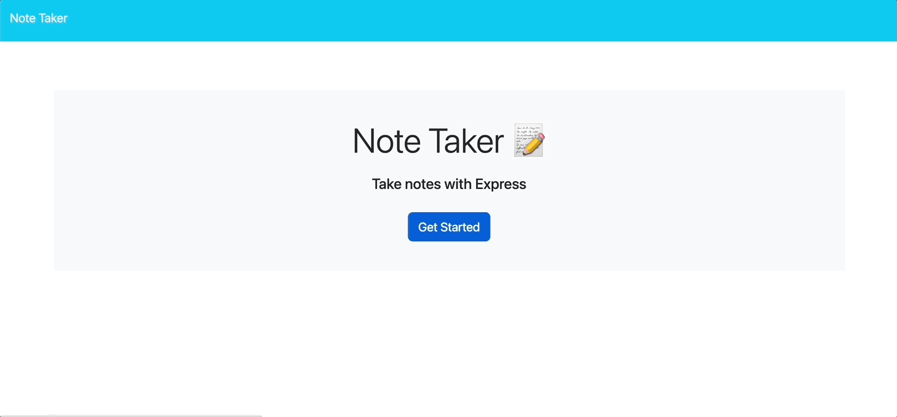

<br>
  <h1 align="center">Note Taker</h1>

  ## Description
  This application allows you to write a title and text and save to your notes column. It is essential that the form you're actively using can be cleared, as well as the ability to delete notes from your dashboard.
  <br>

  
  
  This project is centered around Express.js and building the backend of the application. It was quite a simple project as we were supplied with the front-end starter code. This app was deployed using Heroku.
  <br>

  
 

  ## Table of Contents
  - [Installation](#installation)
  - [User Story](#user-story)
  - [Acceptance Criteria](#acceptance-criteria)
  - [Usage](#usage)
  - [License](#license)
  - [Contributing](#contributing)
  - [Questions](#questions)

  ## Installation
  `npm init -y`: create a package.json file
  <br>
  `npm install`: install dependencies

  ### Dependencies
  `npm i express`
  <br>
  `npm i uuid`: generating ids for the notes
  
  ## User Story
  ```
  AS A small business owner
I WANT to be able to write and save notes
SO THAT I can organize my thoughts and keep track of tasks I need to complete
  ```

  ## Acceptance Criteria
```
GIVEN a note-taking application
WHEN I open the Note Taker
THEN I am presented with a landing page with a link to a notes page
WHEN I click on the link to the notes page
THEN I am presented with a page with existing notes listed in the left-hand column, plus empty fields to enter a new note title and the note’s text in the right-hand column
WHEN I enter a new note title and the note’s text
THEN a "Save Note" button and a "Clear Form" button appear in the navigation at the top of the page
WHEN I click on the Save button
THEN the new note I have entered is saved and appears in the left-hand column with the other existing notes and the buttons in the navigation disappear
WHEN I click on an existing note in the list in the left-hand column
THEN that note appears in the right-hand column and a "New Note" button appears in the navigation
WHEN I click on the "New Note" button in the navigation at the top of the page
THEN I am presented with empty fields to enter a new note title and the note’s text in the right-hand column and the button disappears
 ```

  ## Usage
  Run this application with the command:
  ` npm start
  `
  ## License
  The application is covered under the following license: [MIT](https://opensource.org/licenses/MIT)

  ## Contributing
  I will not be accepting contributions to this repository at this time.
  <br>

  ## Questions
  Questions about this repository? My best point of contact is via [Email](mailto:jayastarrbaldwin@gmail.com) 
  <br>
  If you'd like to view more of my work in GitHub, my profile is: [jayabaldwin](https://github.com/jayabaldwin) 
